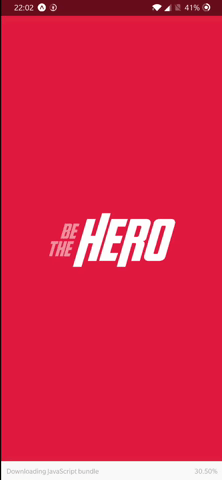

<h1 align="center">Welcome to Be The Hero 👋</h1>

  
  

> An application created using React, React Native, Expo and Node.js in order to help Non-profit organizations to raise funds for their cases.

## Demos

### Web

### Mobile

## Features

### Backend

#### Entities

- NPO
- Case (incident)

#### Functionalities

- [x] NPO Login
- [x] NPO Logout
- [x] Register NPO
- [x] Register case
- [x] Delete case
- [x] List all cases from NPO
- [x] List all cases
- [x] Contact NPO

### Frontend

- [x] Login page
- [x] Configurate Routes
- [x] Register NPO
- [x] List all cases from NPO
- [x] Register new case
- [x] Connect to API

### Mobile

- [x] Splash screen
- [x] Configurate navigation
- [x] Cases page
- [x] Cases details
- [x] Open Whatsapp and Email
- [x] Connect to API

### Improvements

- [x] Validation
- [-] Tests
- [ ] Deploy
- [ ] Static linters and formatter: ESLint, Prettier, etc
- [ ] JWT Authentication
- [x] Styled Components

## Run

To run, run the `backend` then the `frontend` and/or the `mobile`. The specific instructions to run each service is detailed on the README inside each folder.

## Author

👤 **Fabricio Pirini**

- Website: https://fabriciopirini.netlify.app/
- Github: [@fabriciopirini](https://github.com/fabriciopirini)

## Show your support

Give a ⭐️ if this project helped you!

---

_This README was generated with ❤️ by [readme-md-generator](https://github.com/kefranabg/readme-md-generator)_
